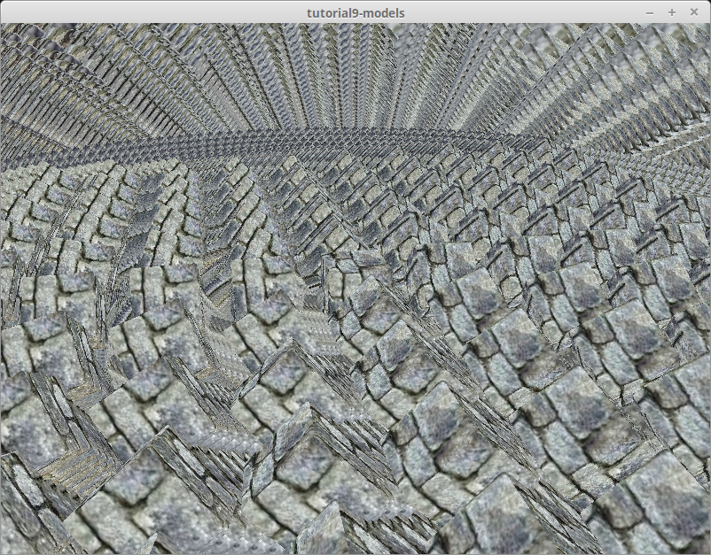

# The Swapchain

<!--
## First, some house keeping: State
-->
## 最初にいくつか状態監視を: State
<!--
For convenience we're going to pack all the fields into a struct, and create some methods on that.
-->
最初に便利のためにすべてのフィールドをまとめた構造体を作り、それにメソッドを追加しましょう。

```rust
// main.rs
struct State {
    surface: wgpu::Surface,
    device: wgpu::Device,
    queue: wgpu::Queue,
    sc_desc: wgpu::SwapChainDescriptor,
    swap_chain: wgpu::SwapChain,
    size: winit::dpi::PhysicalSize<u32>,
}

impl State {
    // Creating some of the wgpu types requires async code
    // いくつかの wgpu の型を作成するときに非同期コードが必要になります。
    async fn new(window: &Window) -> Self {
        unimplemented!()
    }

    fn resize(&mut self, new_size: winit::dpi::PhysicalSize<u32>) {
        unimplemented!()
    }

    fn input(&mut self, event: &WindowEvent) -> bool {
        unimplemented!()
    }

    fn update(&mut self) {
        unimplemented!()
    }

    fn render(&mut self) {
        unimplemented!()
    }
}
```

<!--
I'm glossing over `State`s fields, but they'll make more sense as I explain the code behind the methods.
-->
ここから `State` のフィールドに手を加えていきますが、メソッドの後ろにあるコードの詳細も説明していきますのでより理解できるでしょう。

## State::new()
<!--
The code for this is pretty straight forward, but let's break this down a bit.
-->
このコードはきれいで直線的です。少しずつブレイクダウンしていきましょう。

```rust
impl State {
    // ...
    async fn new(window: &Window) -> Self {
        let size = window.inner_size();

        // The instance is a handle to our GPU
        // BackendBit::PRIMARY => Vulkan + Metal + DX12 + Browser WebGPU
        let instance = wgpu::Instance::new(wgpu::BackendBit::PRIMARY);
        let surface = unsafe { instance.create_surface(window) };
        let adapter = instance.request_adapter(
            &wgpu::RequestAdapterOptions {
                power_preference: wgpu::PowerPreference::Default,
                compatible_surface: Some(&surface),
            },
        ).await.unwrap();
```

<!--
The `surface` is used to create the `swap_chain`. Our `window` needs to implement [raw-window-handle](https://crates.io/crates/raw-window-handle)'s `HasRawWindowHandle` trait to access the native window implementation for `wgpu` to properly create the graphics backend. Fortunately, winit's `Window` fits the bill. We also need it to request our `adapter`.
-->
`surface` は `swap_chain` を作るために使われます。引数に渡す `window` は [raw-window-handle](https://crates.io/crates/raw-window-handle) の `HasRawWindowHandle` trait を実装している必要があります。naitive window 実装にアクセスし、`wgpu` の graphics バックエンドを作るためです。幸運なことに winit の `Window` は目的に適っています。`surface` は `adaptor` を作るのにも必要です。

<!--
We need the `adapter` to create the device and queue.
-->
`adapter` は `device` と `queue` を作るのに必要です。

```rust
        let (device, queue) = adapter.request_device(
            &wgpu::DeviceDescriptor {
                features: wgpu::Features::empty(),
                limits: wgpu::Limits::default(),
                shader_validation: true,
            },
            None, // Trace path
        ).await.unwrap();
```

<!--
The `features` field on `DeviceDescriptor`, allows us to specify what extra features we want. For this simple example, I've deviced to not use any extra features.
-->
`DeviceDescriptor` の `features` フィールドはどのような拡張機能を利用するかを明示します。このシンプルな example では拡張機能を使わないでデバイスを作成します。

<div class="note">

<!--
The device you have limits the features you can use. If you want to use certain features you may need to limit what devices you support, or provide work arounds.
-->
利用するデバイスは機能が制限されている場合があります。もし制限されているある機能を利用しようとする場合、サポートするデバイスを制限するかワークアラウンド(回避策)を提供する必要があります。

<!--
You can get a list of features supported by your device using `adapter.features()`, or `device.features()`.
-->
デバイスがサポートしている機能のリストは `adapter.features()` か `device.features()` で取得することができます。

<!--
You can view a full list of features [here](https://docs.rs/wgpu/0.6.0/wgpu/struct.Features.html).
-->
機能のリストの全体は[こちら](https://docs.rs/wgpu/0.6.0/wgpu/struct.Features.html)で見ることができます。

</div>

<!--
The `limits` field describes the limit of certain types of resource we can create. We'll use the defaults for this tutorial, so we can support most devices. You can view a list of limits [here](https://docs.rs/wgpu/0.6.0/wgpu/struct.Limits.html).
-->
`limits` フィールドは特定のタイプのリソースしか作れないような制限を指定します。このチュートリアルではデフォルトを指定しますので、ほとんどのデバイスをサポートできます。制限のリストは[こちら](https://docs.rs/wgpu/0.6.0/wgpu/struct.Limits.html)で見ることができます。

```rust
        let sc_desc = wgpu::SwapChainDescriptor {
            usage: wgpu::TextureUsage::OUTPUT_ATTACHMENT,
            format: wgpu::TextureFormat::Bgra8UnormSrgb,
            width: size.width,
            height: size.height,
            present_mode: wgpu::PresentMode::Fifo,
        };
        let swap_chain = device.create_swap_chain(&surface, &sc_desc);
```
<!--
Here we are defining and creating the `swap_chain`. The `usage` field describes how the `swap_chain`'s underlying textures will be used. `OUTPUT_ATTACHMENT` specifies that the textures will be used to write to the screen (we'll talk about more `TextureUsage`s later).
-->
これは `swap_chain` の定義と生成です。使っているフィールドの詳細は `swap_chain` の下位の texture で使われることになります。`OUTPUT_ATTACHMENT` は screen に描画するときに texture を利用することを明確化しています。(後で Texture の使い方も触れます)

<!--
The `format` defines how the `swap_chain`s textures will be stored on the gpu. Usually you want to specify the format of the display you're using. As of writing, I was unable to find a way to query what format the display has through `wgpu`, though [there are plans on including such a method](https://github.com/gfx-rs/wgpu-rs/issues/123#issuecomment-555803321), so `wgpu::TextureFormat::Bgra8UnormSrgb` will do for now. We use `wgpu::TextureFormat::Bgra8UnormSrgb` because that's the format that's [guaranteed to be natively supported by the swapchains of all the APIs/platforms](https://github.com/gfx-rs/wgpu-rs/issues/123#issuecomment-555800583) which are currently supported.
-->
`format` はどのような形式で `swap_chain` の texture を gpu に保存するかを指定します。大抵はあなたが使っているディスプレイのフォーマットを指定します。執筆時点では `wgpu` を通してどのフォーマットが使えるか問い合わせることができないので今のところは `wgpu::TextureFormat::Bgra8UnormSrgb` を指定します。([そのようなメソッドを追加する計画はあります](https://github.com/gfx-rs/wgpu-rs/issues/123#issuecomment-555803321))私たちが `wgpu::TextureFormat::Bgra8UnormSrgb` を使うのはこれが現在サポートされている[すべてのAPIやプラットフォームでネイティブサポートされていることが保証されているからです。](https://github.com/gfx-rs/wgpu-rs/issues/123#issuecomment-555800583)

<!--
`width` and `height`, are self explanatory.
-->
`width` と `height` はそのままの意味です。

<!--
The `present_mode` uses the `wgpu::PresentMode` enum which is defined as follows.
-->
`present_mode` は `wgpu::PresentMode` enum を使います。これは以下のように定義されています。

```rust
#[repr(C)]
#[derive(Copy, Clone, Debug, PartialEq, Eq, Hash)]
#[cfg_attr(feature = "serde", derive(Serialize, Deserialize))]
pub enum PresentMode {
    /// The presentation engine does **not** wait for a vertical blanking period and
    /// the request is presented immediately. This is a low-latency presentation mode,
    /// but visible tearing may be observed. Will fallback to `Fifo` if unavailable on the
    /// selected  platform and backend. Not optimal for mobile.
    ///
    /// presentation engine は垂直同期を待たずに即座にリクエストを送信します。
    /// これは低遅延なプレゼンテーションモードですが、画面に乱れが出るかもしれません。
    /// `Fifo` が選択した platform や backend で使えない場合に fallback されます。
    /// モバイルに最適ではありません。
    Immediate = 0,
    /// The presentation engine waits for the next vertical blanking period to update
    /// the current image, but frames may be submitted without delay. This is a low-latency
    /// presentation mode and visible tearing will **not** be observed. Will fallback to `Fifo`
    /// if unavailable on the selected platform and backend. Not optimal for mobile.
    ///
    /// presentation engine は次の垂直同期を待って current image を更新しますが、
    /// フレームに遅れが出るかもしれません。これは低遅延なプレゼンテーションモードで、
    /// 目に見える画面の乱れは発生しません。
    /// `Fifo` が選択した platform や backend で使えない場合に fallback されます。
    /// モバイルに最適ではありません。
    Mailbox = 1,
    /// The presentation engine waits for the next vertical blanking period to update
    /// the current image. The framerate will be capped at the display refresh rate,
    /// corresponding to the `VSync`. Tearing cannot be observed. Optimal for mobile.
    ///
    /// presentation engine は次の垂直同期を待って current image を更新します。
    /// framerate はディスプレイのリフレッシュレートが上限となり、`VSync` に相当します。
    /// 画面の乱れは発生しません。
    /// モバイルに最適です。
    Fifo = 2,
}
```

<!--
At the end of the method, we simply return the resulting struct.
-->
メソッドの最後で、シンプルに構造体を返却します。

```rust
        Self {
            surface,
            device,
            queue,
            sc_desc,
            swap_chain,
            size,
        }
    }
    // ...
}
```

<!--
We'll want to call this in our main method before we enter the event loop.
-->
main() のイベントループに入る前にこれを呼び出します。

```rust
use futures::executor::block_on;

// Since main can't be async, we're going to need to block
// main は async にできないので同期呼び出しする必要があります。
let mut state = block_on(State::new(&window));
```

## resize()
<!--
If we want to support resizing in our application, we're going to need to recreate the `swap_chain` everytime the window's size changes. That's the reason we stored the physical `size` and the `sc_desc` used to create the swapchain. With all of these, the resize method is very simple.
-->
もしアプリケーションの画面のリサイズをサポートしたければ、画面サイズの変更があるたびに `swap_chain` の再生成が必要です。なぜなら State 構造体に物理ウインドウのサイズを `size` として保持しているし `sc_desc` はその値を利用して生成されているからです。なので `resize` メソッドは単純にそれらすべてを置き換えます。

```rust
// impl State
fn resize(&mut self, new_size: winit::dpi::PhysicalSize<u32>) {
    self.size = new_size;
    self.sc_desc.width = new_size.width;
    self.sc_desc.height = new_size.height;
    self.swap_chain = self.device.create_swap_chain(&self.surface, &self.sc_desc);
}
```

<!--
There's nothing really different here from creating the `swap_chain` initially, so I won't get into it.
-->
これは最初に `swap_chain` を作っている時と何も変わらないので詳細は説明しません。

<--
We call this method in `main()` in the event loop for the following events.
-->
`main()` のイベントループの中でイベントを捕捉します。

```rust
match event {
    // ...

    } if window_id == window.id() => if !state.input(event) {
        match event {
            // ...

            WindowEvent::Resized(physical_size) => {
                state.resize(*physical_size);
            }
            WindowEvent::ScaleFactorChanged { new_inner_size, .. } => {
                // new_inner_size is &&mut so we have to dereference it twice
                // new_inner_size は &&mut なので二回 deref します。
                state.resize(**new_inner_size);
            }
            // ...
}
```

## input()

<!--
`input()` returns a `bool` to indicate whether an event has been fully processed. If the method returns `true`, the main loop won't process the event any further.
-->
`input()` はそのイベントが完全に処理されたどうかを `bool` で返すようにしています。もしメソッドが `true` を返すときは、main loop はそれ以上そのイベントを処理しません。

<!--
We're just going to return false for now because we don't have any events we want to capture.
-->
最初は　`false` を返しましょう。まだ何のイベントもキャプチャしてませんからね。

```rust
// impl State
fn input(&mut self, event: &WindowEvent) -> bool {
    false
}
```

<!--
We need to do a little more work in the event loop. We want `State` to have priority over `main()`. Doing that (and previous changes) should have your loop looking like this.
-->
イベントループで少しやることがあります。`State` は `main()` のなかで優先して処理したいので、イベントループ内を以下のようにしましょう。(イベントループの前は変更する必要ありません)

```rust
// main()
event_loop.run(move |event, _, control_flow| {
    match event {
        Event::WindowEvent {
            ref event,
            window_id,
        } if window_id == window.id() => if !state.input(event) { // UPDATED!
            match event {
                WindowEvent::CloseRequested => *control_flow = ControlFlow::Exit,
                WindowEvent::KeyboardInput {
                    input,
                    ..
                } => {
                    match input {
                        KeyboardInput {
                            state: ElementState::Pressed,
                            virtual_keycode: Some(VirtualKeyCode::Escape),
                            ..
                        } => *control_flow = ControlFlow::Exit,
                        _ => {}
                    }
                }
                WindowEvent::Resized(physical_size) => {
                    state.resize(*physical_size);
                }
                WindowEvent::ScaleFactorChanged { new_inner_size, .. } => {
                    state.resize(**new_inner_size);
                }
                _ => {}
            }
        }
        _ => {}
    }
});
```

## update()

<!--
We don't have anything to update yet, so leave the method empty.
-->
まだ update でやることはないので空っぽにしておきましょう。

```rust
fn update(&mut self) {
    // remove `unimplemented!()`
}
```

## render()

<!--
Here's where the magic happens. First we need to get a frame to render to. This will include a `wgpu::Texture` and `wgpu::TextureView` that will hold the actual image we're drawing to (we'll cover this more when we talk about textures).
-->
ここで魔法が起こります(訳者:今はおまじないコードだけどあとで説明するということかな)。最初にフレームを render しようとするときです。ここは実際の描画イメージを保持する `wgpu::Texture` と `wgpu::TextureView` の話があります。(ここは texture について話すときにさらに補足します)

```rust
// impl State

fn render(&mut self) {
    let frame = self.swap_chain.get_current_frame()
        .expect("Timeout getting texture")
        .output;
```

<!--
We also need to create a `CommandEncoder` to create the actual commands to send to the gpu. Most modern graphics frameworks expect commands to be stored in a command buffer before being sent to the gpu. The `encoder` builds a command buffer that we can then send to the gpu.
-->
そして実際に GPU に送信するコマンドを生成する `CommandEncoder` を作る必要があります。多くの現代的なグラフィックフレームワークは GPU にコマンドを送る前にバッファに保存されることを期待しています。この `encoder` も GPU に送信する前のバッファをビルドします。

```rust
    let mut encoder = self.device.create_command_encoder(&wgpu::CommandEncoderDescriptor {
        label: Some("Render Encoder"),
    });
```

<!--
Now we can actually get to clearing the screen (long time coming). We need to use the `encoder` to create a `RenderPass`. The `RenderPass` has all the methods to do the actual drawing. The code for creating a `RenderPass` is a bit nested, so I'll copy it all here, and talk about the pieces.
-->
これで実際にスクリーンを綺麗にすることができます(長かった)。`encoder` を使って　`RenderPass` を作ります。`RenderPass` は実際に描画するためのすべてのメソッドを持っています。`RenderPass` を作るためのコードはちょっとネストしていますが全部コピーしてください。それぞれの部分について話していきましょう。

```rust
    {
        let _render_pass = encoder.begin_render_pass(&wgpu::RenderPassDescriptor {
            color_attachments: &[
                wgpu::RenderPassColorAttachmentDescriptor {
                    attachment: &frame.view,
                    resolve_target: None,
                    ops: wgpu::Operations {
                        load: wgpu::LoadOp::Clear(wgpu::Color {
                            r: 0.1,
                            g: 0.2,
                            b: 0.3,
                            a: 1.0,
                        }),
                        store: true,
                    }
                }
            ],
            depth_stencil_attachment: None,
        });
    }

    // submit will accept anything that implements IntoIter
    self.queue.submit(std::iter::once(encoder.finish()));
}
```

<!--
First things first, let's talk about the `{}`. `encoder.begin_render_pass(...)` borrows `encoder` mutably (aka `&mut self`). We can't call `encoder.finish()` until we release that mutable borrow. The `{}` around `encoder.begin_render_pass(...)` tells rust to drop any variables within them when the code leaves that scope thus releasing the mutable borrow on `encoder` and allowing us to `finish()` it. If you don't like the `{}`, you can also use `drop(render_pass)` to achieve the same effect.
-->
最初の `{}` から見ていきましょう。`encoder.begin_render_pass(...)` は `encoder` を mutable に借用しています。(要は `&mut self` してるということ)。なのでその借用が解放されるまで `encoder.finish()` を呼び出せません。`{}` で　`encoder.begin_render_pass(...)` を囲むことで rust に変数がそのスコープが終われば drop できることを教え、`encoder` の mutable な借用を解放し `finish()` を呼べるようにしています。もし `{}` で囲むのがいやであれば `drop(render_pass)` とすることで同じ効果を得ることもできます。

<!--
We can get the same results by removing the `{}`, and the `let _render_pass =` line, but we need access to the `_render_pass` in the next tutorial, so we'll leave it as is.
-->
`{}` を消して `let _render_pass` を消しても同じ効果を得ることができますが、`_render_pass` は次のチュートリアルで必要になるので消さないでください。

<!--
The last lines of the code tell `wgpu` to finish the command buffer, and to submit it to the gpu's render queue.
-->
最終行は `wgpu` にコマンドバッファが完了したことを通知し、GPU のレンダーキューに提出しています。

<!--
We need to update the event loop again to call this method. We'll also call update before it too.
-->
event loop でこれらのメソッドを呼び出すためにもう一度変更しましょう。

```rust
// main()
event_loop.run(move |event, _, control_flow| {
    match event {
        // ...
        Event::RedrawRequested(_) => {
            state.update();
            state.render();
        }
        Event::MainEventsCleared => {
            // RedrawRequested will only trigger once, unless we manually
            // request it.
            // RedrawRequested は一度だけこのイベントを呼び出すので、手動でここを呼び出す必要はありません。
            window.request_redraw();
        }
        // ...
    }
});
```

<!--
With all that, you should be getting something that looks like this.
-->
これで以下のような画面が出てくるはずです。


<!--
## Wait, what's going on with RenderPassDescriptor?
-->
## おや `RenderPassDescriptor` は何をやっているの？

<!--
Some of you may be able to tell what's going on just by looking at it, but I'd be remiss if I didn't go over it. Let's take a look at the code again.
-->
もしかしたらパッと見ただけで何をやっているかわかる人もいるかもしれませんが、私がそれをさぼるといけませんね。コードを見ていきましょう。

```rust
&wgpu::RenderPassDescriptor {
    color_attachments: &[
        // ...
    ],
    depth_stencil_attachment: None,
}
```

<!--
A `RenderPassDescriptor` only has two fields: `color_attachments` and `depth_stencil_attachment`. The `color_attachements` describe where we are going to draw our color to.
-->
`RenderPassDescriptor` は `color_attachments` と `depth_stencil_attachment` の二つのフィールドしかありません。`color_attachments` にはどこにどんな色を使って描画するかを記述します。

<!--
We'll use `depth_stencil_attachment` later, but we'll set it to `None` for now.
-->
`depth_stencil_attachment` は後で使いますが、今は None をセットしておきましょう。

```rust
wgpu::RenderPassColorAttachmentDescriptor {
    attachment: &frame.view,
    resolve_target: None,
    ops: wgpu::Operations {
        load: wgpu::LoadOp::Clear(wgpu::Color {
            r: 0.1,
            g: 0.2,
            b: 0.3,
            a: 1.0,
        }),
        store: true,
    }
}
```

<!--
The `RenderPassColorAttachmentDescriptor` has the `attachment` field which informs `wgpu` what texture to save the colors to. In this case we specify `frame.view` that we created using `swap_chain.get_next_texture()`. This means that any colors we draw to this attachment will get drawn to the screen.
-->
`RenderPassColorAttachmentDescriptor` は `attachement` フィールドを持ち `wgpu` に texture がどんな色を持つかという情報を伝えます。ここでは `frame.view` を渡していて、これは `swap_chain.get_next_texture()` で作られたものです。つまりこのアタッチメントに描く色はすべてスクリーン上に描かれます。

<!--
This is the texture that will received the resolved output. This will be the same as `attachment` unless multisampling is enabled. We don't need to specify this, so we leave it as `None`.
-->
これは解決された出力を受け取るテクスチャです。multisampling を有効にしていなければ `attachement` と同じようなものです。今は必要がないので `None` を指定しておきます。

<!--
The `obs` field takes an `wpgu::Operations` object. This tells wgpu what to do with the colors on the screen (specified by `frame.view`). The `load` field tells wgpu how to handle colors store from the previous frame. Currently we are clearing the screen with a bluish color.
-->
`obs` field は `wpgu::Operations` を受け取ります。これは wgpu にどの色を使ってスクリーンを描画するか教えます(`frame.view` で指定されています)。`load` フィールドは前のフレームの色をどのように扱うかを決めます。今は青みがかった色でスクリーンをクリアしています。

<div class="note">

<!--
It's not uncommon to not clear the screen if the streen is going to be completely covered up with objects. If you're scene doesn't cover the entire screen however you'll end up with something like this.
-->
スクリーンが完全にオブジェクトで覆われている場合、スクリーンをクリアしないケースケースも珍しくありません。もしスクリーンを全てカバーしていないシーンであればこのようになります。



</div>

## Challenge

<!--
Modify the `input()` method to capture mouse events, and update the clear color using that. *Hint: you'll probably need to use `WindowEvent::CursorMoved`*
-->
`input()` を修正しマウスイベントをキャプチャして clear_color を変化させてみましょう。ヒント: あなたはたぶん WindowEvent::CursorMoved が必要になるでしょう。

<AutoGithubLink/>
