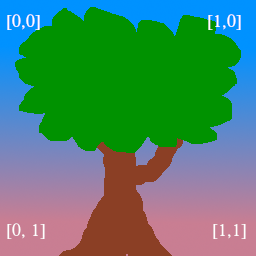

# Textures and bind groups

<!--
Up to this point we have been drawing super simple shapes. While we can make a game with just triangles, trying to draw highly detailed objects would massively limit what devices could even run our game. However, we can get around this problem with **textures**.
-->
この時点で、とてもシンプルな形を描画できるようになりました。三角形だけでもゲームを作ることはできますが、物体の詳細を表現しようとするためには非常に限定的です。しかし **texture** を使うことでそれらの問題を回避できます。

<!--
Textures are images overlayed on a triangle mesh to make it seem more detailed. There are multiple types of textures such as normal maps, bump maps, specular maps and diffuse maps. We're going to talk about diffuse maps, or more simply, the color texture.
-->
texture は画像を三角形のメッシュにのせてメッシュをより詳細なものに見せてくれます。テクスチャには複数のタイプがありのノーマルマップ、バンプマップ、スペキュラーマップ、ディヒューズマップなどがあります。ディヒューズマップを素人の言葉でいうと color texture ということになります。

<!--
## Loading an image from a file
-->
## ファイルからイメージをロードする

<!--
If we want to map an image to our mesh, we first need an image. Let's use this happy little tree:
-->
イメージをメッシュにマップしようとするなら、最初に画像が必要です。このハッピーで小さな木を使いましょう。


<!--
We'll use the [image crate](https://crates.io/crates/image) to load our tree. We already added to our dependencies in the first section, so all we have to do is use it.
-->
[image crate](https://crates.io/crates/image) を使って木の画像をロードします。すでに依存のファーストセクションに追加されているので使うことができます。

<!--
In `State`'s `new()` method add the following just after creating the `swap_chain`:
-->
`State` の `new()` メソッドの `swap_chain` の前に追加しましょう。

```rust
let swap_chain = device.create_swap_chain(&surface, &sc_desc);
// NEW!

let diffuse_bytes = include_bytes!("happy-tree.png");
let diffuse_image = image::load_from_memory(diffuse_bytes).unwrap();
let diffuse_rgba = diffuse_image.as_rgba8().unwrap();

use image::GenericImageView;
let dimensions = diffuse_image.dimensions();
```

<!--
Here we grab the bytes from our image file and load them into an image which is then converted into a `Vec` of rgba bytes. We also save the image's dimensions for when we create the actual `Texture`. 
-->
これは画像ファイルからバイト列をとってき、イメージをロードした後に rgba のバイトの `Vec` に変換しています。また、画像の次元も `Texture` 生成時のために保存しておきます。

<!--
Now, let's create the `Texture`:
-->
では `Texture` を作っていきましょう。

```rust
let texture_size = wgpu::Extent3d {
    width: dimensions.0,
    height: dimensions.1,
    depth: 1,
};
let diffuse_texture = device.create_texture(
    &wgpu::TextureDescriptor {
        // All textures are stored as 3D, we represent our 2D texture
        // by setting depth to 1.
        // すべてのテクスチャは三次元に配置されます。
        // 二次元のテクスチャは depth 1 として表現します。
        size: texture_size,
        mip_level_count: 1, // We'll talk about this a little later(この項目についてはあとで説明します)
        sample_count: 1,
        dimension: wgpu::TextureDimension::D2,
        format: wgpu::TextureFormat::Rgba8UnormSrgb,
        // SAMPLED tells wgpu that we want to use this texture in shaders
        // COPY_DST means that we want to copy data to this texture
        // SAMPLED は GPU にテクスチャを sharder で使うことを教えます。
        // COPY_DST はこのテクスチャにデータをコピーしてほしいということを意味しています。
        usage: wgpu::TextureUsage::SAMPLED | wgpu::TextureUsage::COPY_DST,
        label: Some("diffuse_texture"),
    }
);
```

<!--
## Getting data into a Texture
-->
## テクスチャからデータを取得する

<!--
The `Texture` struct has no methods to interact with the data directly. However, we can use a method on the `queue` we created earlier called `write_texture` to load the texture in. Let's take a look at how we do that:
-->
`Texture` 構造体にはデータを直接操作するためのメソッドはありません。しかしながらテクスチャをロードしたときに `queue` の `write_texture` を呼び出すことで早く作成できます。どのようにそれを使うか見てみましょう。

```rust
queue.write_texture(
    // Tells wgpu where to copy the pixel data
    wgpu::TextureCopyView {
        texture: &diffuse_texture,
        mip_level: 0,
        origin: wgpu::Origin3d::ZERO,
    },
    // The actual pixel data
    diffuse_rgba,
    // The layout of the texture
    wgpu::TextureDataLayout {
        offset: 0,
        bytes_per_row: 4 * dimensions.0,
        rows_per_image: dimensions.1,
    },
    texture_size,
);
```

<div class="note">

<!--
The old way of writing data to a texture was to copy the pixel data to a buffer and then copy it to the texture. Using `write_texture` is a bit more efficient as it uses one less buffer - I'll leave it here though in case you need it.
-->
テクスチャにデータを書き込むには、古いやり方ではピクセルデータを buffer にコピーしてからテクスチャーにコピーしていました。`write_texture` を使うと一つのバッファしか使わないのでより効率的です。必要になる場合があるかもしれないのでここに残しておきます。

```rust
let buffer = device.create_buffer_init(
    &wgpu::util::BufferInitDescriptor {
        label: Some("Temp Buffer"),
        contents: &diffuse_rgba,
        usage: wgpu::BufferUsage::COPY_SRC,
    }
);

let mut encoder = device.create_command_encoder(&wgpu::CommandEncoderDescriptor {
    label: Some("texture_buffer_copy_encoder"),
});

encoder.copy_buffer_to_texture(
    wgpu::BufferCopyView {
        buffer: &buffer,
        offset: 0,
        bytes_per_row: 4 * dimensions.0,
        rows_per_image: dimensions.1,
    },
    wgpu::TextureCopyView {
        texture: &diffuse_texture,
        mip_level: 0,
        array_layer: 0,
        origin: wgpu::Origin3d::ZERO,
    },
    size,
);

queue.submit(std::iter::once(encoder.finish()));
```

<!--
The `bytes_per_row` field needs some consideration. This value needs to be a multiple of 256. Check out [the gif tutorial](../../showcase/gifs/#how-do-we-make-the-frames) for more details.
-->
`bytes_per_row` フィールドはいくつか考慮が必要なことがあります。この値は256の倍数である必要があります。 詳細は [the gif tutorial](../../showcase/gifs/#how-do-we-make-the-frames) をチェックしてください。

</div>

## TextureViews and Samplers

<!--
Now that our texture has data in it, we need a way to use it. This is where a `TextureView` and a `Sampler` come in. A `TextureView` offers us a *view* into our texture. A `Sampler` controls how the `Texture` is *sampled*. Sampling works similar to the eyedropper tool in GIMP/Photoshop. Our program supplies a coordinate on the texture (known as a *texture coordinate*), and the sampler then returns the corresponding color based on the texture and some internal parameters.
-->
これで texture はデータを持つようになりましたので、使い方が必要です。`TextureView` と `Sampler` というものの出番です。 `TextureView` は texture のビューを提供します。`Sampler` は `Texture` のサンプリングの仕方をコントロールします。サンプリングは Gimp や Photoshop のスポイトツールのような役割を果たします。プログラムは与えられたテクスチャ上の座標(**テクスチャ座標**と言われる)を提供し、`Sampler` はそのテクスチャや内部パラメータに基づいて対応する色を返します。

<!--
Let's define our `diffuse_texture_view` and `diffuse_sampler` now:
-->
`diffuse_texture_view` と `diffuse_sampler` を定義しましょう。

```rust
// We don't need to configure the texture view much, so let's
// let wgpu define it.
// texture_view は wgpu が定義してくれるので、あまり設定することはありません。
let diffuse_texture_view = diffuse_texture.create_view(&wgpu::TextureViewDescriptor::default());
let diffuse_sampler = device.create_sampler(&wgpu::SamplerDescriptor {
    address_mode_u: wgpu::AddressMode::ClampToEdge,
    address_mode_v: wgpu::AddressMode::ClampToEdge,
    address_mode_w: wgpu::AddressMode::ClampToEdge,
    mag_filter: wgpu::FilterMode::Linear,
    min_filter: wgpu::FilterMode::Nearest,
    mipmap_filter: wgpu::FilterMode::Nearest,
    ..Default::default()
});
```

<!--
The `address_mode_*` parameters determine what to do if the sampler gets a texture coordinate that's outside of the texture itself. We have a few options to choose from:

* `ClampToEdge`: Any texture coordinates outside the texture will return the color of the nearest pixel on the edges of the texture.
* `Repeat`: The texture will repeat as texture coordinates exceed the textures dimensions.
* `MirrorRepeat`: Similar to `Repeat`, but the image will flip when going over boundaries.
-->
`address_mode_*` パラメータは、sampler が texture の外の座標の外にを指定したときのふるまいを指定します。設定できる項目は3つです。

* `ClampToEdge` : どんなはみ出したテクスチャ座標でも、その座標に最も近いテクスチャの端の色を返します
* `Repeat` : texture 座標が texture のサイズを超えたときは texture が繰り返されます
* `MirrorRepeat` : `Repeat` と似ていますが、イメージの境界で反転します。


<!--
The `mag_filter` and `min_filter` options describe what to do when a fragment covers multiple pixels, or there are multiple fragments for a single pixel. This often comes into play when viewing a surface from up close, or from far away. 
-->
`mag_filter` と `min_filter` はフラグメントが複数のピクセルをカバーするときまたは、1つのピクセルがそれぞれ複数のフラグメントが対応するときのオプションです。これは表面に近づいたり遠ざかったりするときに作用します。

<!--
There are 2 options:
* `Linear`: Attempt to blend the in-between fragments so that they seem to flow together.
* `Nearest`: In-between fragments will use the color of the nearest pixel. This creates an image that's crisper from far away, but pixelated upc close. This can be desirable, however, if your textures are designed to be pixelated, like in pixel art games, or voxel games like Minecraft.
-->
2つのオプションがあります。
* `Linear` : このオプションはその間にあるフラグメントをブレンドしようとするので、なめらかな表示になります。
* `Nearest` : フラグメントに最も近いピクセルの色を選択します。これは遠い場合にはイメージをギザギザにしますが、近い場合にはピクセルが見えるようになります。これは、 Minecraft のようにピクセル/ボクセルを強調したゲームの場合には好ましいでしょう。

<!--
Mipmaps are a complex topic, and will require [their own section in the future](/todo). For now, we can say that `mipmap_filter` functions similar to `(mag/min)_filter` as it tells the sampler how to blend between mipmaps.
-->
mipmap は複雑なトピックです。[将来的にこのためのセクション](/todo)が必要です。今のところ、`mipmap_filter` は `mag/min_filter` と似ていて、どのように mipmap をブレンドするか GPU に教えると考えておけばよいでしょう。

<!--
I'm using some defaults for the other fields. If you want to see what they are, check [the wgpu docs](https://docs.rs/wgpu/0.6.0/wgpu/struct.SamplerDescriptor.html).
-->
そのほかのフィールドについてはデフォルトの値を使います。ほかにどのようなものがあるか知りたければ [the wgpu docs](https://docs.rs/wgpu/0.6.0/wgpu/struct.SamplerDescriptor.html) を確認してください。

<!--
All these different resources are nice and all, but they don't do us much good if we can't plug them in anywhere. This is where `BindGroup`s and `PipelineLayout`s come in.
-->
これらのリソースはとても良いものですが、どこにも接続できなければ意味がありません。 `BindGroup` と `PipelineLayout` についてみていきましょう。

## The BindGroup

<!--
A `BindGroup` describes a set of resources and how they can be accessed by a shader. We create a `BindGroup` using a `BindGroupLayout`. Let's make one of those first.
-->
`BindGroup` は shader にリソース一式にどのようにアクセスすればいいのかを記載します。`BindGroup` を `BindGroupLayout` と使って作りましょう。最初に以下のように書きましょう。

```rust
let texture_bind_group_layout = device.create_bind_group_layout(
    &wgpu::BindGroupLayoutDescriptor {
        entries: &[
            wgpu::BindGroupLayoutEntry {
                binding: 0,
                visibility: wgpu::ShaderStage::FRAGMENT,
                ty: wgpu::BindingType::SampledTexture {
                    multisampled: false,
                    dimension: wgpu::TextureViewDimension::D2,
                    component_type: wgpu::TextureComponentType::Uint,
                },
                count: None,
            },
            wgpu::BindGroupLayoutEntry {
                binding: 1,
                visibility: wgpu::ShaderStage::FRAGMENT,
                ty: wgpu::BindingType::Sampler {
                    comparison: false,
                },
                count: None,
            },
        ],
        label: Some("texture_bind_group_layout"),
    }
);
```

<!--
Our `texture_bind_group_layout` has two entries: one for a sampled texture at binding 0, and one for a sampler at binding 1. Both of these bindings are visible only to the fragment shader as specified by `FRAGMENT`. The possible values for this field are any bitwise combination of `NONE`, `VERTEX`, `FRAGMENT`, or `COMPUTE`. Most of the time we'll only use `FRAGMENT` for textures and samplers, but it's good to know what else is available.
-->
`texture_bind_group_layout` は2つのエントリがあり、binding 0 はサンプリングされた texture で、binding 1 は sampler です。それぞれの binding はフラグメントシェーダーでだけ可視になるよう `FLAGMENT` を指定しています。`NONE`, `VERTEX`, `FRAGMENT`, `COMPUTE` のそれぞれの bit flat を立てて指定することが可能です。texture と sampler はほとんど常に `FLAGMENT` でだけ使われるものですが、それを知っておくことはよいことでしょう。

<!--
With `texture_bind_group_layout`, we can now create our `BindGroup`:
-->
`texture_bind_group_layout` と一緒に `BindGroup` を作りましょう。

```rust
let diffuse_bind_group = device.create_bind_group(
    &wgpu::BindGroupDescriptor {
        layout: &texture_bind_group_layout,
        entries: &[
            wgpu::BindGroupEntry {
                binding: 0,
                resource: wgpu::BindingResource::TextureView(&diffuse_texture_view),
            },
            wgpu::BindGroupEntry {
                binding: 1,
                resource: wgpu::BindingResource::Sampler(&diffuse_sampler),
            }
        ],
        label: Some("diffuse_bind_group"),
    }
);
```

<!--
Looking at this you might get a bit of déjà vu! That's because a `BindGroup` is a more specific declaration of the `BindGroupLayout`. The reason why they're separate is it allows us to swap out `BindGroup`s on the fly, so long as they all share the same `BindGroupLayout`. For each texture and sampler we create, we need to create its own `BindGroup`.
-->
ここでデジャヴを感じるかもしれません。`BindGroup` の多くの仕様の宣言は `BindGroupLayout` でなされているからです。なぜこれらが分かれているかという理由は、同じ `BindGroupLayout` を共有している場合は `BindGroup` に実行中のスワップアウトを可能にするためです。

<!--
Now that we have our `diffuse_bind_group`, let's add it to our `State` struct:
-->
これで `diffuse_bind_group` が手に入ったので `State` に追加しましょう。

```rust
struct State {
    surface: wgpu::Surface,
    device: wgpu::Device,
    queue: wgpu::Queue,
    sc_desc: wgpu::SwapChainDescriptor,
    swap_chain: wgpu::SwapChain,
    size: winit::dpi::PhysicalSize<u32>,
    colour: wgpu::Color,
    render_pipeline: wgpu::RenderPipeline,
    vertex_buffer: wgpu::Buffer,
    index_buffer: wgpu::Buffer,
    num_indicies: u32,
    diffuse_bind_group: wgpu::BindGroup, // NEW!
}
```

And make sure we return these fields in the `new` method:

```rust
impl State {
    async fn new() -> Self {
        // ...
        Self {
            surface,
            device,
            queue,
            sc_desc,
            swap_chain,
            size,
            render_pipeline,
            vertex_buffer,
            index_buffer,
            num_indices,
            // NEW!
            diffuse_bind_group,
        }
    }
}
```

<!--
Now that we've got our `BindGroup`, we can use it in our `render()` function.
-->
これで `BindGroup` が得られたので `render()` 内で使うことができます。

```rust
// render()
// ...
render_pass.set_pipeline(&self.render_pipeline);
render_pass.set_bind_group(0, &self.diffuse_bind_group, &[]); // NEW!
render_pass.set_vertex_buffer(0, &self.vertex_buffer.slice(..));
render_pass.set_index_buffer(&self.index_buffer.slice(..));
render_pass.draw_indexed(0..self.num_indices, 0, 0..1);
```

## PipelineLayout

<!--
Remember the `PipelineLayout` we created back in [the pipeline section](/beginner/tutorial3-pipeline#how-do-we-use-the-shaders)? Now we finally get to use it! The `PipelineLayout` contains a list of `BindGroupLayout`s that the pipeline can use. Modify `render_pipeline_layout` to use our `texture_bind_group_layout`.
-->
`PipelineLayout` を [the pipeline section](/beginner/tutorial3-pipeline#how-do-we-use-the-shaders) で作ったことを覚えていますか？これは最後に使います。`PipelineLayout` は `BindGroupLayout` のリストを含めて使うことができます。`render_pipeline_layout` を変更して `texture_bind_group_layout` を使いましょう。

```rust
fn create_pipeline(
    device: &wgpu::Device,
    sc_desc: &wgpu::SwapChainDescriptor,
    vs_module: wgpu::ShaderModule,
    fs_module: wgpu::ShaderModule,
    texture_bind_group_layout: wgpu::BindGroupLayout, // NEW!
) -> wgpu::RenderPipeline {
    let render_pipeline_layout = device.create_pipeline_layout(
        &wgpu::PipelineLayoutDescriptor {
            label: Some("Render Pipeline Layout"), // NEW!
            bind_group_layouts: &[&texture_bind_group_layout], // NEW!
            push_constant_ranges: &[],
        }
    );
    // ...
}
```

<!--
## A change to the VERTICES
-->
## VERTICES を変更します。
<!--
There's a few things we need to change about our `Vertex` definition. Up to now we've been using a `color` attribute to set the color of our mesh. Now that we're using a texture, we want to replace our `color` with `tex_coords`. These coordinates will then be passed to the `Sampler` to retrieve the appropriate color.
-->
`Vertex` の定義を少し変更する必要があります。今まで `color` attribute で mesh の色を設定していました。texture を使いたいので `color` を `tex_coords` に置き換えましょう。座標は `Sampler` に渡され適切な色が取得されます。

<!--
Since our `tex_coords` are two dimensional, we'll change the field to take two floats instead of three.
-->
`tex_coords` は 2 次元なので、 float の値も 3 つから 2 つになります。

<!--
First, we'll change the `Vertex` struct:
-->
最初に `Vertex` 構造体を変更します。

```rust
#[repr(C)]
#[derive(Copy, Clone, Debug)]
struct Vertex {
    position: [f32; 3],
    tex_coords: [f32; 2], // NEW!
}
```

<!--
And then reflect these changes in the `VertexBufferDescriptor`:
-->
次に `VertexBufferDescriptor` に変更を反映します。

```rust
impl Vertex {
    fn desc<'a>() -> wgpu::VertexBufferDescriptor<'a> {
        use std::mem;
        wgpu::VertexBufferDescriptor {
            stride: mem::size_of::<Vertex>() as wgpu::BufferAddress,
            step_mode: wgpu::InputStepMode::Vertex,
            attributes: &[
                wgpu::VertexAttributeDescriptor {
                    offset: 0,
                    shader_location: 0,
                    format: wgpu::VertexFormat::Float3,
                },
                wgpu::VertexAttributeDescriptor {
                    offset: mem::size_of::<[f32; 3]>() as wgpu::BufferAddress,
                    shader_location: 1,
                    format: wgpu::VertexFormat::Float2, // NEW!
                },
            ]
        }
    }
}
```

<!--
Lastly we need to change `VERTICES` itself. Replace the existing definition with the following:
-->
最後に `VERTICES` 自身を変更します。今ある定義を以下のように置き換えます。

```rust
// Changed
const VERTICES: &[Vertex] = &[
    Vertex { position: [-0.0868241, 0.49240386, 0.0], tex_coords: [0.4131759, 0.99240386], }, // A
    Vertex { position: [-0.49513406, 0.06958647, 0.0], tex_coords: [0.0048659444, 0.56958646], }, // B
    Vertex { position: [-0.21918549, -0.44939706, 0.0], tex_coords: [0.28081453, 0.050602943], }, // C
    Vertex { position: [0.35966998, -0.3473291, 0.0], tex_coords: [0.85967, 0.15267089], }, // D
    Vertex { position: [0.44147372, 0.2347359, 0.0], tex_coords: [0.9414737, 0.7347359], }, // E
];
```

## Shader time

<!--
With our new `Vertex` structure in place it's time to update our shaders. We'll first need to pass our `tex_coords` into the vertex shader and then use them over to our fragment shader to get the final color from the `Sampler`. Let's start with the vertex shader:
-->
新しい `Vertex` 構造体は shader にも更新が必要です。最初に `tex_coords` を vertex shader に渡すようにし、それを使い flagment shader が `Sampler` から最終的な色を得ることができるようにします。 vertex shader から行きましょう。

```glsl
// shader.vert
#version 450

layout(location=0) in vec3 a_position;
// Changed
layout(location=1) in vec2 a_tex_coords;

// Changed
layout(location=0) out vec2 v_tex_coords;

void main() {
    // Changed
    v_tex_coords = a_tex_coords;
    gl_Position = vec4(a_position, 1.0);
}
```

<!--
Now that we have our vertex shader outputting our `tex_cords`, we need to change the fragment shader to take them in. With these coordinates, we'll finally be able to use our sampler to get a color from our texture.
-->
vertex shader は `tex_cords` を出力するようになったので、fragment shader はそれを取得するようにします。これらの座標があることで、最終的に sampler が texture から 色を取得できます。

```glsl
// shader.frag
#version 450

// Changed
layout(location=0) in vec2 v_tex_coords;
layout(location=0) out vec4 f_color;

// NEW!
layout(set = 0, binding = 0) uniform texture2D t_diffuse;
layout(set = 0, binding = 1) uniform sampler s_diffuse;

void main() {
    // Changed
    f_color = texture(sampler2D(t_diffuse, s_diffuse), v_tex_coords);
}
```

<!--
You'll notice that `t_diffuse` and `s_diffuse` are defined with the `uniform` keyword, they don't have `in` nor `out`, and the layout definition uses `set` and `binding` instead of `location`. This is because `t_diffuse` and `s_diffuse` are what's known as *uniforms*. We won't go too deep into what a uniform is, until we talk about uniform buffers in the [cameras section](/beginner/tutorial6-uniforms/). 
-->
`t_diffuse` と `s_diffuse` が `in` や `out` ではなく `uniform` キーワードで定義され、layout の定義が `location` の代わりに `set` と `binding` であることに気づくでしょう。これは `t_diffuse` と `s_diffuse` はどこからでも同様に呼び出されるからです。uniform が何かということについては [cameras section](/beginner/tutorial6-uniforms/) で深く扱います。

<!--
For now, all we need to know is that `set = 0` corresponds to the 1st parameter in `set_bind_group()` and `binding = 0` relates the the `binding` specified when we create the `BindGroupLayout` and `BindGroup`.
-->
現段階で知っておくべきことは `set = 0` は `set_bind_group()` の最初のパラメータに一致し、`binding = 0` は `BindGroupLayout` や `BindGroup` で定義された `binding` に関連するということです。

## The results

<!--
If we run our program now we should get the following result:
-->
プログラムを走らせると以下のような結果になるでしょう。


<!--
That's weird, our tree is upside down! This is because wgpu's world coordinates have the y-axis pointing up, while texture coordinates have the y-axis pointing down. In other words, (0, 0) in texture coordinates coresponds to the top-left of the image, while (1, 1) is the bottom right.
-->
何たる運命、我らの木はひっくり返ったぞ！これは wgpu のワールド座標系は y 軸を向いているのに対してテクスチャ座礁系の y 軸は下を向いているからです。別の言葉で言い換えると、テクスチャ座標系の(0, 0)は画像の左上を指し、(1, 1)は右下を指します。



<!--
We can get our triangle right-side up by inverting the y coordinate of each texture coordinate:
-->
三角形のそれぞれのテクスチャ座標の右側を反転させることで対応できます。

```rust
const VERTICES: &[Vertex] = &[
    // Changed
    Vertex { position: [-0.0868241, 0.49240386, 0.0], tex_coords: [0.4131759, 0.00759614], }, // A
    Vertex { position: [-0.49513406, 0.06958647, 0.0], tex_coords: [0.0048659444, 0.43041354], }, // B
    Vertex { position: [-0.21918549, -0.44939706, 0.0], tex_coords: [0.28081453, 0.949397057], }, // C
    Vertex { position: [0.35966998, -0.3473291, 0.0], tex_coords: [0.85967, 0.84732911], }, // D
    Vertex { position: [0.44147372, 0.2347359, 0.0], tex_coords: [0.9414737, 0.2652641], }, // E
];
```

<!--
With that in place, we now have our tree right-side up on our hexagon:
-->
これで右側の座標が反映されて五角形が適切に描かれます。


<!--
## Cleaning things up
-->
## コードのクリーンアップ

<!--
For convenience sake, let's pull our texture code into its module. We'll first need to add the [anyhow](https://docs.rs/anyhow/) crate to our `Cargo.toml` file to simplify error handling;
-->
便利に使えるように texture のコードをモジュール化しましょう。まず [anyhow](https://docs.rs/anyhow/) というエラーハンドリングをシンプルにする crate を `Cargo.toml` に追加します。


```toml
[dependencies]
image = "0.23"
winit = "0.22"
cgmath = "0.17"
env_logger = "0.7"
log = "0.4"
futures = "0.3"
wgpu ="0.6"
bytemuck = "1.4"
anyhow = "1.0" // NEW!
```

<!--
Then, in a new file called `src/texture.rs`, add the following:
-->
そして `src/texture.rs` という新しいファイルに以下を追加します。

```rust
use image::GenericImageView;
use anyhow::*;

pub struct Texture {
    pub texture: wgpu::Texture,
    pub view: wgpu::TextureView,
    pub sampler: wgpu::Sampler,
}

impl Texture {
    pub fn from_bytes(
        device: &wgpu::Device,
        queue: &wgpu::Queue,
        bytes: &[u8], 
        label: &str
    ) -> Result<Self> {
        let img = image::load_from_memory(bytes)?;
        Self::from_image(device, queue, &img, Some(label))
    }

    pub fn from_image(
        device: &wgpu::Device,
        queue: &wgpu::Queue,
        img: &image::DynamicImage,
        label: Option<&str>
    ) -> Result<Self> {
        let rgba = img.as_rgba8().unwrap();
        let dimensions = img.dimensions();

        let size = wgpu::Extent3d {
            width: dimensions.0,
            height: dimensions.1,
            depth: 1,
        };
        let texture = device.create_texture(
            &wgpu::TextureDescriptor {
                label,
                size,
                mip_level_count: 1,
                sample_count: 1,
                dimension: wgpu::TextureDimension::D2,
                format: wgpu::TextureFormat::Rgba8UnormSrgb,
                usage: wgpu::TextureUsage::SAMPLED | wgpu::TextureUsage::COPY_DST,
            }
        );

        queue.write_texture(
            wgpu::TextureCopyView {
                texture: &texture,
                mip_level: 0,
                origin: wgpu::Origin3d::ZERO,
            },
            rgba,
            wgpu::TextureDataLayout {
                offset: 0,
                bytes_per_row: 4 * dimensions.0,
                rows_per_image: dimensions.1,
            },
            size,
        );

        let view = texture.create_view(&wgpu::TextureViewDescriptor::default());
        let sampler = device.create_sampler(
            &wgpu::SamplerDescriptor {
                address_mode_u: wgpu::AddressMode::ClampToEdge,
                address_mode_v: wgpu::AddressMode::ClampToEdge,
                address_mode_w: wgpu::AddressMode::ClampToEdge,
                mag_filter: wgpu::FilterMode::Linear,
                min_filter: wgpu::FilterMode::Nearest,
                mipmap_filter: wgpu::FilterMode::Nearest,
                ..Default::default()
            }
        );
        
        Ok(Self { texture, view, sampler })
    }
}
```

<!--
Note that we're returning a `CommandBuffer` with our texture. This means we can load multiple textures at the same time, and then submit all their command buffers at once.
-->
`CommandBuffer` を texture と一緒に返しています。これは複数のテクスチャを同時にロードし、複数の command buffer の submit を一度に行えるということを意味しています。

<!--
We need to import `texture.rs` as a module, so somewhere at the top of `main.rs` add the following.
-->
これを使うためには `texture.rs` module を `main.rs` のトップで import する必要があります。

```rust
mod texture;
```

<!--
The texture creation code in `new()` now gets a lot simpler:
-->
texture を作るコードを `new()` に入れるのはとてもシンプルになりました。

```rust
let swap_chain = device.create_swap_chain(&surface, &sc_desc);
let diffuse_bytes = include_bytes!("happy-tree.png"); // CHANGED!
let diffuse_texture = texture::Texture::from_bytes(&device, &queue, diffuse_bytes, "happy-tree.png").unwrap(); // CHANGED!

// Everything up until `let texture_bind_group_layout = ...` can now be removed.
```

<!--
We still need to store the bind group separately so that `Texture` doesn't need know how the `BindGroup` is laid out. Creating the `diffuse_bind_group` changes slightly to use the `view` and `sampler` fields of our `diffuse_texture`:
-->
`Texture` が `BindGroup` がどのようにレイアウトするのか知る必要がないように、bind group は分けて保存する必要があります。`diffuse_bind_group` を作るところは `view` と `sampler` が `diffuse_texture` のものになるなど少し変わります。

```rust
let diffuse_bind_group = device.create_bind_group(
    &wgpu::BindGroupDescriptor {
        layout: &texture_bind_group_layout,
        entries: &[
            wgpu::BindGroupEntry {
                binding: 0,
                resource: wgpu::BindingResource::TextureView(&diffuse_texture.view), // CHANGED!
            },
            wgpu::BindGroupEntry {
                binding: 1,
                resource: wgpu::BindingResource::Sampler(&diffuse_texture.sampler), // CHANGED!
            }
        ],
        label: Some("diffuse_bind_group"),
    }
);
```

<!--
Finally, let's update our `State` field to use our shiny new `Texture` struct, as we'll need it in future tutorials.
-->
最後に新しい `Texture` 構造体をチュートリアルで使うために `State` フィールドに変更を加えます。

```rust
struct State {
    // ...
    diffuse_bind_group: wgpu::BindGroup,
    diffuse_texture: texture::Texture, // NEW
}
```

```rust
impl State {
    async fn new() -> Self {
        // ...
        Self {
            // ...
            num_indices,
            diffuse_bind_group,
            diffuse_texture, // NEW
        }
    }
}
```

<!--
Phew! 
-->
なんと!

<!--
With these changes in place, the code should be working the same as it was before, but we now have a much easier way to create textures.
-->
これらの変更をくわえてもコードはそれまでと同じように動きますが、テクスチャを作るのはとても容易になりました。

## Challenge

<!--
Create another texture and swap it out when you press the space key.
-->
もう一つ別の texture を作ってスペースキーで切り替えれるようにしてみましょう。

<AutoGithubLink/>
